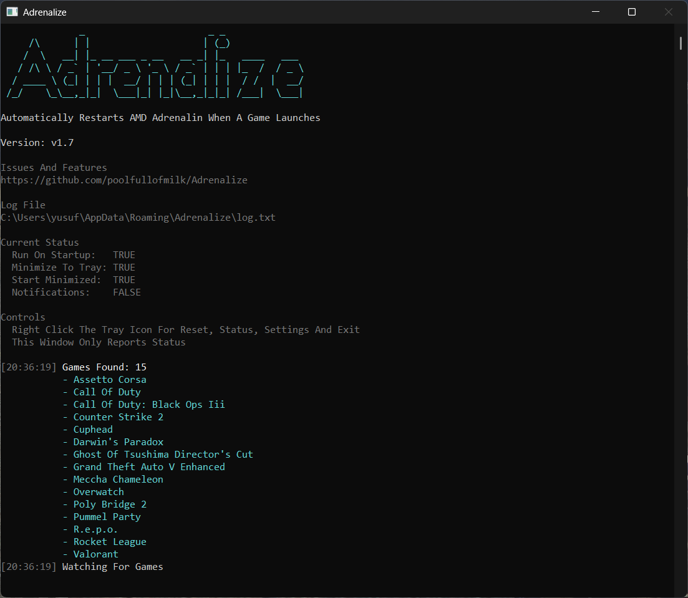

# Adrenalize

> Archived. Replaced By [Adrenaless](https://github.com/poolfullofmilk/Adrenaless), A One Shot Script That Stops AMD Hooking Into Your Games

Keeps AMD Adrenalin Healthy While You Game And Fixes It In One Click When It Breaks



## The Problem

AMD's services and Adrenalin itself fall over, usually right after a game exits. Once they have, Adrenalin will not open again until every AMD process is killed by hand in Task Manager. On top of that, AMD's Record And Stream switch injects a capture hook into every game even when the overlay, metrics and instant replay are all turned off, and that hook fights with other capture tools like Medal or Steam.

Adrenalize watches for AMD falling over and repairs it in the background, keeps Record And Stream switched off, and gives you one tray action that fixes everything by hand.

## Features
- Repairs AMD Automatically When One Of Its Services Crashes
- Checks AMD After Every Game Closes And Repairs It Only If Something Is Actually Broken
- Starts Adrenalin Again If It Exits On Its Own
- Checks AMD At Startup And Repairs A Stack That Was Already Broken
- Keeps AMD Record And Stream Off So No AMD Capture Hook Is Injected Into Your Games
- Never Touches AMD While A Game Is Running
- One Click Reset In The Tray: Stops The Services, Closes Every AMD Process, Starts Everything Again
- Adrenalin Always Comes Back In The Background, No Window Ever Appears
- Detects Installed Games From Steam, Epic, Riot, Roblox, Rockstar And Common Game Folders

## Quick Start
1. Download And Run Adrenalize_v2.3.exe
2. Accept The UAC Prompt
3. Leave It Running In The Tray
4. If Adrenalin Ever Misbehaves, Right Click The Tray Icon And Pick Reset

## Adding A Game

The scanner covers the common launchers. Anything it misses goes in `%AppData%\Adrenalize\games.txt`, one process name per line, then pick Rescan Games in the tray menu.

```
# One Process Name Per Line
Cyberpunk2077
```

## Important
- Administrator Rights Are Required To Stop And Start The AMD Services
- The Console Is A Read Only Status Display, Every Action Lives In The Tray Menu
- The Log File Is At %AppData%\Adrenalize\log.txt
- To Use AMD Recording Again, Turn Record And Stream Back On In Adrenalin And Stop Adrenalize

## Technical Details
- Windows Console App With A Tray Icon, Built With C# On .NET 10
- Game Exits And AMD Service Crashes Are Caught Through WMI Events, Nothing Is Polled
- AMD Processes Are Matched By Their Publisher, The Same Signal Task Manager Shows
- Adrenalin Is Started With AMD's Own Logon Command, Without Elevation, So It Never Draws A Window
- Startup Runs Through Task Scheduler So Logon Never Shows A UAC Prompt
- Ships As One Self Contained Executable, No Runtime Or Install Needed

## Download
Get The Latest Version From The [Latest Release](https://github.com/poolfullofmilk/Adrenalize/releases/latest)
